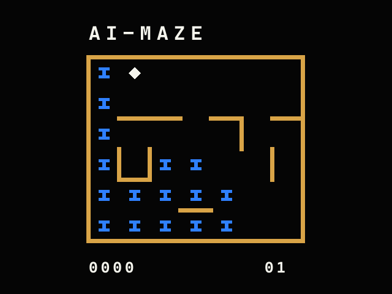

# Videopac G7000 AI-MAZE



**AI-MAZE** is a 4 KiB homebrew puzzle game for the Philips Videopac G7000
and Magnavox Odyssey². Guide the marker through every cell of a 7×6 maze
without visiting a cell twice.

The cartridge contains 31 deterministic and uniquely solvable levels. The
selected mazes are ordered by the generator's composite difficulty score.

## Playing

- Use joystick 1 to move through an open passage.
- Visit all 42 cells exactly once to complete the level.
- Press the joystick button to restart the current level.
- A level is worth 100 points on the first attempt. Each restart subtracts
  five points, down to a minimum of 10.
- Completing a level plays a five-tone fanfare and advances to the next one.

At `SELECT GAME`, type a level number from 1 to 31. A single-digit level can
be confirmed with the joystick button; `Enter` starts level 1 immediately.

The ready-to-run cartridge image is
[`roms/ai-maze-42-31levels.rom`](roms/ai-maze-42-31levels.rom).

## Build

The build requires [Node.js](https://nodejs.org/) and uses the small assembler
included in this repository. On Windows, run:

```bat
build_maze_line_42.cmd
```

The script regenerates and verifies all 31 levels, assembles the cartridge,
and checks that the resulting ROM is exactly 4096 bytes.

For a quicker verification without regenerating the levels:

```bat
node tools\verify_maze_levels_42.js roms\levels_31_7x6.bin roms\levels_31_7x6.txt
node tools\assemble.js maze_line_42.a48 roms\ai-maze-42-31levels.rom --4k
```

## Running in O2EM 1.18

O2EM and the console BIOS are not included. Set `O2EM_DIR` to your local O2EM
directory and run the launcher:

```bat
set O2EM_DIR=C:\Emulators\o2em118win
run_7x6_o2em118.cmd
```

The launcher maps the arrow keys to movement and `Space` to the joystick
button. Press `F8` in O2EM to save a numbered BMP snapshot in `docs/images`.

## Repository contents

- `maze_line_42.a48` — Intel 8048 source code.
- `roms/levels_31_7x6.bin` — packed level data used by the cartridge.
- `roms/levels_31_7x6.txt` — level metrics and solution paths.
- `tools/generate_maze_levels_42.js` — deterministic level generator.
- `tools/verify_maze_levels_42.js` — structural and unique-solution verifier.
- `tools/assemble.js` — two-pass assembler used by the build.
- `SPEC_7X6.md` — technical specification and memory layout.

The game image above is rendered directly from the cartridge's level data to
show the in-game layout and palette.
